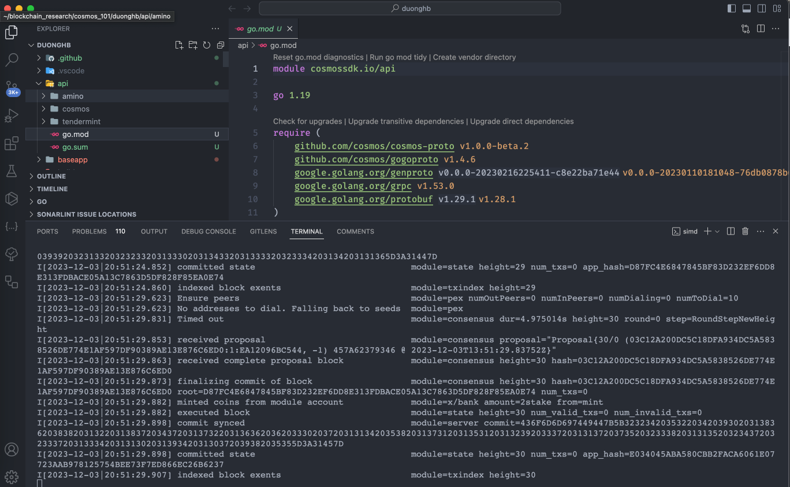

## Requirements

- [Go version >= 1.20, < 1.21](https://go.dev/dl/)
- Cosmos SDK v0.47.0

### Creating a new blockchain

Create alice account

```sh
./build/simd keys add alice \
    --keyring-backend test \
    --home ./private/.simapp
```

Check alice account

```sh
./build/simd keys show alice \
    --keyring-backend test \
    --home ./private/.simapp
```

Prefund for alice account

```sh
./build/simd genesis add-genesis-account alice 100000000stake \
    --home ./private/.simapp \
    --keyring-backend test
```

Check balances

````sh
grep -A 10 balances ./private/.simapp/config/genesis.json
``

Create first Validator and stake
```sh
./build/simd genesis gentx alice 70000000stake \
    --home ./private/.simapp \
    --keyring-backend test \
    --chain-id learning-chain-1
````

Collect genesis data

```sh
./build/simd genesis collect-gentxs \
    --home ./private/.simapp
```

Validate Genesis

```sh
 ./build/simd genesis validate-genesis --home ./private/.simapp
```

Building the blockchain

```sh
make build
```

## Starting a blockchain node

```sh
./build/simd start --home ./private/.simapp/
```

## Result

The blockchain is now running!

Chain 

To learn more, see the [Run node](https://tutorials.cosmos.network/tutorials/3-run-node/).
