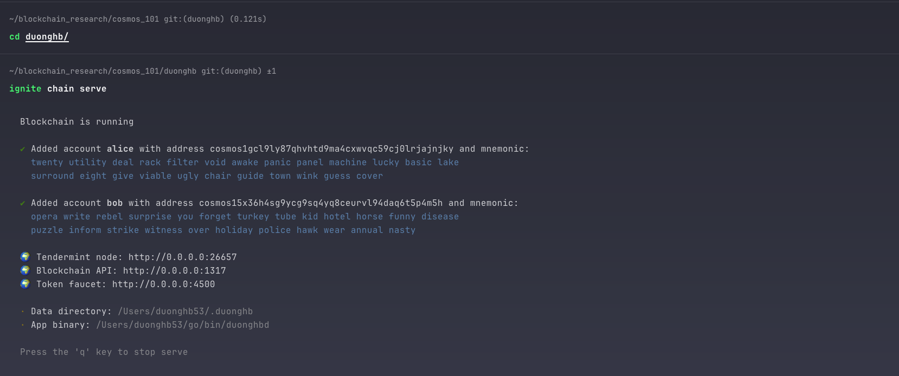
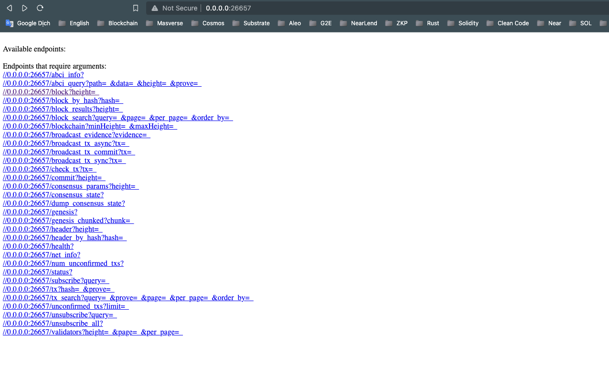
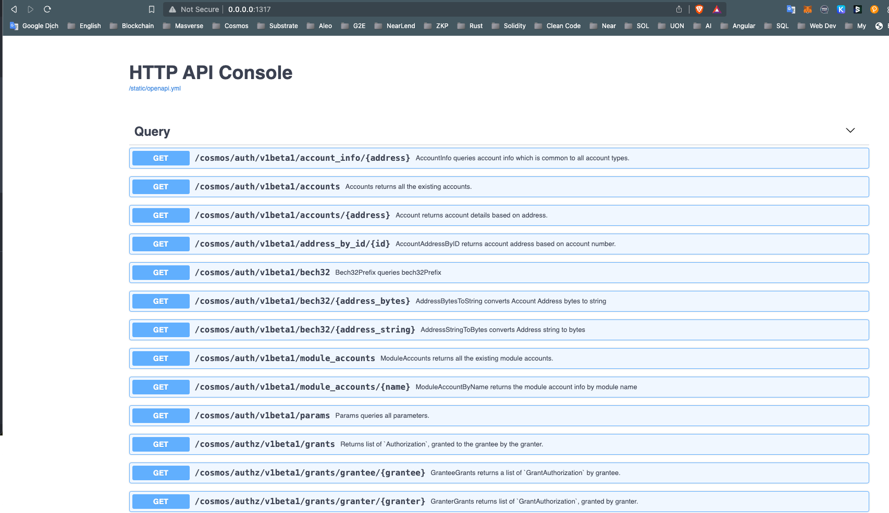

## Requirements

- [Ignite CLI version >= 0.27](https://github.com/ignite/cli)
- [Go version >= 0.21](https://go.dev/dl/)

### Creating a new blockchain

To create a new blockchain, run the following command:

```sh
ignite scaffold chain duonghb
```

## Starting a blockchain node

```sh
cd duonghb
ignite chain serve
```
## Result

The blockchain is now running!

Chain 
RPC 
LCD 


To learn more, see the [Ignite CLI docs](https://docs.ignite.com/guide/getting-started).
